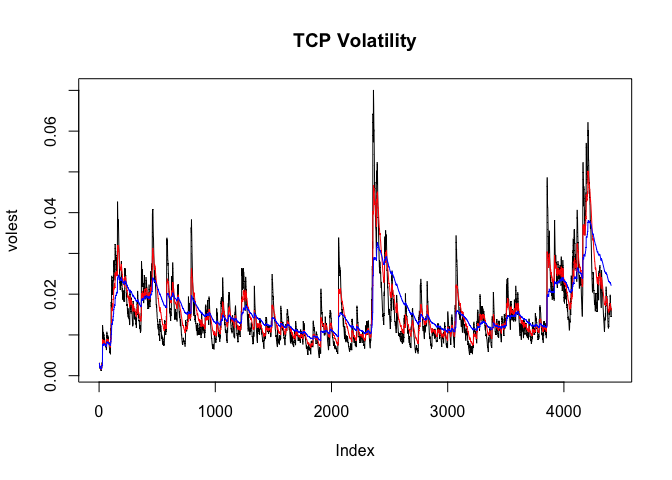
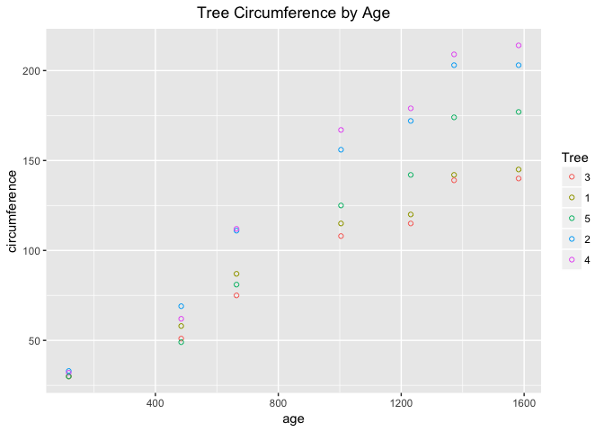
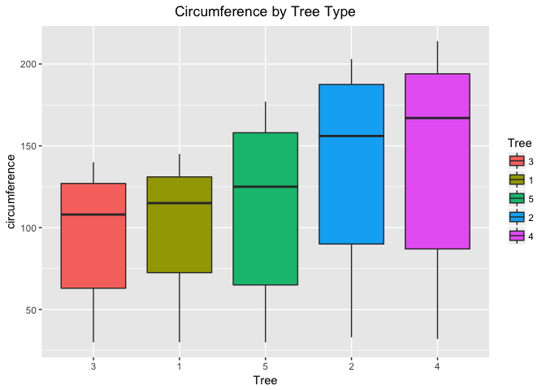
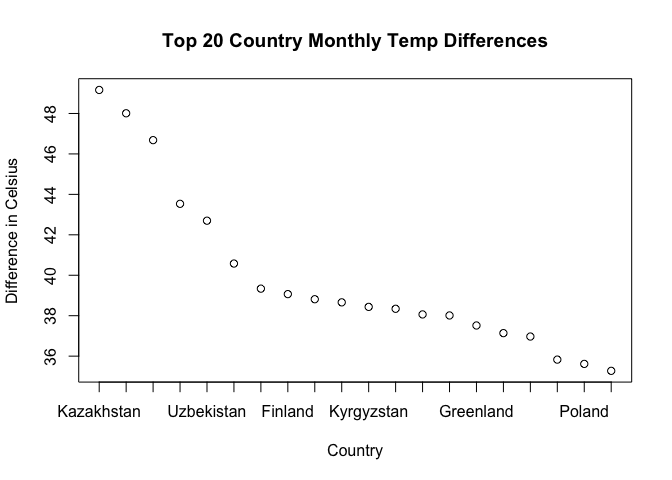
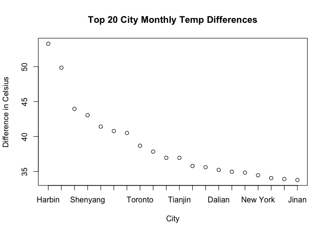

# Case Study 2
Peter Byrd  
November 28, 2016  


##  Question 1

### Create a matrix in SAS, R, and Python and print it

Here is the SAS code for creating a matrix using PROC IML and printing it:

proc iml;

x = {4 5 1 2, 1 0 3 5, 2 1 8 2};

print x;


Here is the R code for creating the same matrix and printing it:


```r
A <- matrix(c(4,1,2,5,0,1,1,3,8,2,5,2),nrow=3,ncol=4)
A
```

```
##      [,1] [,2] [,3] [,4]
## [1,]    4    5    1    2
## [2,]    1    0    3    5
## [3,]    2    1    8    2
```


Finally, here is the Pyton code for creating the same matrix and printing it:


```python
import numpy as np
a = np.matrix('4 5 1 2; 1 0 3 5; 2 1 8 2')
print(a)
```

```
## [[4 5 1 2]
##  [1 0 3 5]
##  [2 1 8 2]]
```

All three methods produce the same matrix.

#  Question 2

### Volatility

We will use stock market data to calcualte the volatility of the stock TCP.  First we need to set our working directory and install the appropriate packages and load the data.


```r
### Set the working directory and load packages
setwd("/Users/pbyrd/Git/CaseStudy2_v2")

### Install and load the following packages: 
library(tseries)

## Read the file
TCPdata <- get.hist.quote('tcp',quote="Close")
```

```
## time series starts 1999-05-25
```

```r
length(TCPdata)
```

```
## [1] 4408
```

We have 4407 records in our TCP data which represents approximately 17 years.

Now we can calculate the log returns of the data.


```r
## Calculate Log Returns and Volatility
## Time series starts 5-25-1999 to 11-23-2016
TCPret  <- log(lag(TCPdata)) - log(TCPdata)
TCPvol  <- sd(TCPret)*sqrt(250)*100
length(TCPret)
```

```
## [1] 4407
```

```r
TCPvol
```

```
## [1] 27.62525
```

From the output of TCPvol, we can see we have a volatility index of 27.6 which is a little more volatile than the S&P index.

Next we will create a function to calculate the volatility over time using different decay factors.


```r
## Create volatility function
Vol <- function (d,logrets){
  var=0
  lam=0
  varlist <- c()
  for (r in logrets) {
    lam = lam*(1 - 1/d) + 1
    var = (1 - 1/lam)*var + (1/lam)*r^2
    varlist <- c(varlist,var)
  }
  sqrt(varlist)}
```

Now that we have our function defined, we can run three scenarios with different decay factors and plot the results.


```r
## Run three scenarios of d=10,30,100
volest <- Vol(10,TCPret)
volest2 <- Vol(30,TCPret)
volest3 <- Vol(100,TCPret)

## Plot the volatility results
plot(volest,type="l")
title(main="TCP Volatility")
lines(volest2,type="l",col="red")
lines(volest3,type="l",col="blue")
```

<!-- -->

From the plot, we see that the volatility spikes around record 2400 which is approximately the year 2009.  There is also a secondary spike around record 4200 which is approximately the year 2015.

#  Question 3

### Orange

We will now view the orange tree data and analyze the growth of the trees.  We start by calculating the mean and median of the trunk circumferences for different sizes of trees by Tree types 1-5.


```r
### Calculate the mean and the median of the trunk circumferences for different sizes of trees
mean(subset(Orange, Tree == 1)$circumference)
```

```
## [1] 99.57143
```

```r
median(subset(Orange, Tree ==1)$circumference)
```

```
## [1] 115
```

```r
mean(subset(Orange, Tree == 2)$circumference)
```

```
## [1] 135.2857
```

```r
median(subset(Orange, Tree ==2)$circumference)
```

```
## [1] 156
```

```r
mean(subset(Orange, Tree == 3)$circumference)
```

```
## [1] 94
```

```r
median(subset(Orange, Tree ==3)$circumference)
```

```
## [1] 108
```

```r
mean(subset(Orange, Tree == 4)$circumference)
```

```
## [1] 139.2857
```

```r
median(subset(Orange, Tree ==4)$circumference)
```

```
## [1] 167
```

```r
mean(subset(Orange, Tree == 5)$circumference)
```

```
## [1] 111.1429
```

```r
median(subset(Orange, Tree ==5)$circumference)
```

```
## [1] 125
```

Now we will create a scatter plot of the data.


```r
# Create a scatter plot of the data
require(ggplot2)
```

```
## Loading required package: ggplot2
```

```r
require(reshape2)
```

```
## Loading required package: reshape2
```

```r
ggplot(Orange, aes(x=age, y=circumference, color=Tree)) + geom_point(shape=1) + 
  ggtitle("Tree Circumference by Age") + theme(plot.title = element_text(hjust = 0.5))
```

<!-- -->

Next we will create a boxplot of the circumference by Tree type.


```r
# Create a boxplot of circumference by Tree
ggplot(Orange, aes(x=Tree, y=circumference)) + geom_boxplot(aes(fill=Tree)) +
  ggtitle("Circumference by Tree Type") + theme(plot.title = element_text(hjust = 0.5))
```

<!-- -->

From the scatter plot and the boxplots, we can see that the the Tree type with the smallest circumference is Tree 3, and the circumferences gradually increase for Tree 1, Tree 5, Tree 2, respectively.  The largest circumference is seen on Tree 4.  It is also interesting that the variance increases as circumference increases by Tree type.

#   Question 4

##  Country and City Temperatures

Before we begin our analysis, we must first set our working directory and load packages.


```r
## Set the working directory and load packages
setwd("/Users/pbyrd/Git/CaseStudy2_v2")
library(tseries)
library(ggplot2)
library(plyr)
```

### Part I

Using the Temp data set, we will find the difference between the maximum and minimum monthly average temperatures for each country and report the top 20 countries with the maximum difference.  We first will load the data and clean up some dates and variables.


```r
#   Part I
##  Read CSV input file
Temp <- read.csv("Data/Temp.csv", header=TRUE)

##  Create single date format
a <- as.Date(Temp$Date,format="%Y-%m-%d") 
b <- as.Date(Temp$Date,format="%m/%d/%Y") 
a[is.na(a)] <- b[!is.na(b)]   # Combine both while keeping their ranks
Temp$Date <- a                # Put it back in your dataframe

##  Remove NA and change Country to a factor
Temp <- Temp[!(is.na(Temp$Monthly.AverageTemp)),]
Temp$Country <- as.factor(Temp$Country)
```

Next we need to create a subset of the data for the year 1900 and beyond.


```r
##  Create a subset of the dates for 1900 and newer
Date1 <- as.Date("1900-01-01")
Temp1900 <- Temp[Temp$Date >= Date1,]
```

Now we need to calculate the difference between the maximum and minimum monthly temperature for each country.


```r
##  Find the difference between max and min monthly avg temp for each country
maxtemp <- tapply(Temp1900$Monthly.AverageTemp, Temp1900$Country, max)
mintemp <- tapply(Temp1900$Monthly.AverageTemp, Temp1900$Country, min)
difftemp <- maxtemp - mintemp
```

We now have our list of the difference in max and min temperatures by country.  Next we need to sort the list and pick off the top 20 largest differences.


```r
##  Sort the data from largest to smallest difference in monthly temperatures and show top 20
difftemp.sorted <- sort(difftemp, decreasing = TRUE)
top20countries <- difftemp.sorted[1:20]
top20countries
```

```
##   Kazakhstan     Mongolia       Russia       Canada   Uzbekistan 
##       49.163       48.010       46.682       43.532       42.698 
## Turkmenistan      Belarus      Finland      Estonia      Ukraine 
##       40.579       39.338       39.068       38.815       38.660 
##   Kyrgyzstan  North Korea       Latvia      Moldova    Greenland 
##       38.436       38.342       38.063       38.012       37.516 
##      Denmark    Lithuania   Tajikistan       Poland      Armenia 
##       37.138       36.970       35.829       35.616       35.273
```

And finally we will plot the results.


```r
### Plot the data
x1names <- names(top20countries)
plot(top20countries,xaxt="n",xlab="Country",ylab="Difference in Celsius",main="Top 20 Country Monthly Temp Differences")
axis(1, at=1:length(x1names), labels=x1names)
```

<!-- -->

### Part II

In this analysis, we will select a subset of the data for the United States.


```r
#   Part II
### Subset the data for US temperatures for dates later than 1900
UStemp <- subset(Temp1900, Country == "United States")
```

Now we will covert the temperatures from celsius to fahrenheit.


```r
### Convert from C to F and add to new column
UStemp["Monthly.AverageTemp_F"] = (UStemp$Monthly.AverageTemp*1.8)+32
```

Next we will prepare the data for conversion to a time series by month and then aggregate by year.


```r
### Remove variables we don't want and rename variables
UStemp_new <- UStemp
UStemp_new <- UStemp_new[,-c(1,3,4)]
UStemp_new <- plyr::rename(x=UStemp_new,
                        replace = c("Monthly.AverageTemp"="AvgTemp_C","Monthly.AverageTemp_F"="AvgTemp_F"))

### Create a time series and aggregate the data by year
UStemp_monthly <- ts(UStemp_new, start=c(1900,1), end=c(2013,9), frequency = 12)
UStemp_yearly <- aggregate(UStemp_monthly, nfrequency=1, FUN=mean)
```

And now we will plot the average land temperature for the United States by year.


```r
### Plot the average land temperature by year
plot(UStemp_yearly,type="l")
```

<!-- -->

Next we will calculate the difference of average land temperature by year and show the maximum difference and the years it occured.


```r
### Calculate the one year difference of average land temperature
UStemp_diff <- diff(UStemp_yearly)
maxdiff <- max(abs(UStemp_diff))
maxdiffyr <- 1900 + which.max(UStemp_diff[,2])
print(c('The max monthly temperature difference in Fahrenheit was ',maxdiff))
```

```
## [1] "The max monthly temperature difference in Fahrenheit was "
## [2] "2.5401"
```

```r
print(c('It occured between the years ',maxdiffyr-1,' and ',maxdiffyr,'.'))
```

```
## [1] "It occured between the years " "1920"                         
## [3] " and "                         "1921"                         
## [5] "."
```

Since we measured the difference from the previuos year, 1920 and 1921 have the largest average temperature difference of 2.54 degrees fahrenheit.

#   Part III

In this analysis, we will find the difference between the maximum and minimum temperatures for each major city and report the top 20 cities with maximum differences for the period since 1900.


```r
### Read CityTemp data
CityTemp <- read.csv("Data/CityTemp.csv", header=TRUE)

### Create single date format
a <- as.Date(CityTemp$Date,format="%Y-%m-%d") 
b <- as.Date(CityTemp$Date,format="%m/%d/%Y") 
a[is.na(a)] <- b[!is.na(b)]   # Combine both while keeping their ranks
CityTemp$Date <- a                # Put it back in your dataframe

### Remove NA
CityTemp <- CityTemp[!(is.na(CityTemp$Monthly.AverageTemp)),]
```

Now we will create a subset of the data for the year 1900 and beyond.


```r
### Create a subset of the dates for 1900 and newer
Date1 <- as.Date("1900-01-01")
CityTemp1900 <- CityTemp[CityTemp$Date >= Date1,]
```

Next we will find the difference in the max and min monthly average temperatures for each city and sort the data from largest to smallest to get our top 20 cities.


```r
### Find the difference between max and min monthly avg temp for each city
maxcitytemp <- tapply(CityTemp1900$Monthly.AverageTemp, CityTemp1900$City, max)
mincitytemp <- tapply(CityTemp1900$Monthly.AverageTemp, CityTemp1900$City, min)
diffcitytemp <- maxcitytemp - mincitytemp

### Sort the data from largest to smallest difference in monthly temperatures and show top 20
diffcitytemp.sorted <- sort(diffcitytemp, decreasing = TRUE)
top20cities <- diffcitytemp.sorted[1:20]
top20cities
```

```
##           Harbin        Changchun           Moscow         Shenyang 
##           53.281           49.844           43.956           43.045 
##         Montreal             Kiev Saint Petersburg          Toronto 
##           41.422           40.784           40.510           38.683 
##          Taiyuan           Peking          Tianjin            Seoul 
##           37.834           36.953           36.953           35.783 
##          Mashhad           Dalian          Chicago         Tangshan 
##           35.610           35.223           34.962           34.833 
##         New York          Baghdad           Berlin            Jinan 
##           34.460           34.047           33.920           33.778
```

And finally we wil plot the data to see the results.


```r
### Plot the data
x2names <- names(top20cities)
plot(top20cities,xaxt="n",xlab="City",ylab="Difference in Celsius",main="Top 20 City Monthly Temp Differences")
axis(1, at=1:length(x2names), labels=x2names)
```

<!-- -->

From a comparison of the graphs of the top 20 countries and the top 20 cities, we can see that many of the top 20 cities are from within the countries that also make the top 20 country list.  It is also interesting that most of the cities and countries are from the farther north parts of the northern hemisphere, which likely see larger temperature fluctuations from their summers and winters.

#    Question 5

###  Holiday Bonus - Thank you!


##   End of case study 2
